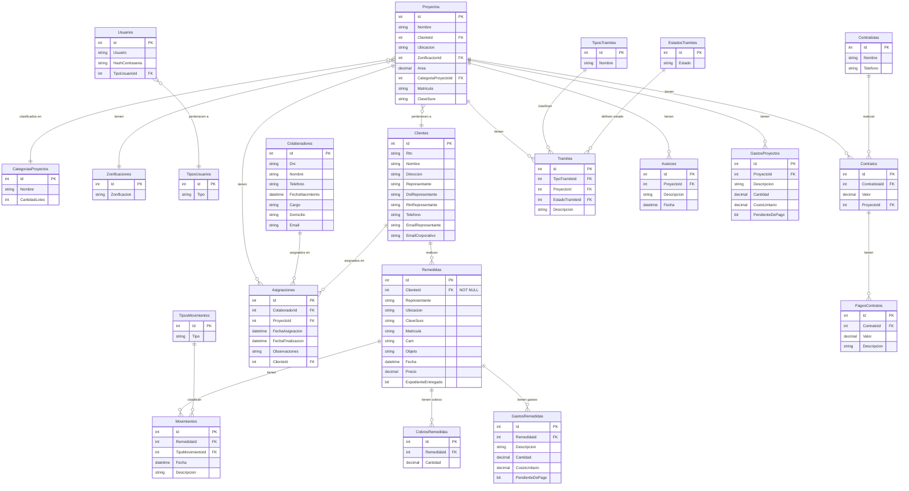

# Diagrama Entidad-Relación - Base de Datos Vemar

## Resumen de Relaciones

| Tabla Padre | Tabla Hijo | Cardinalidad | FK |
|---|---|---|---|
| **Clientes** | Proyectos | 1:N | `ClienteId` |
| **Clientes** | Asignaciones | 1:N | `ClienteId` |
| **Clientes** | Remedidas | 1:N | `ClienteId` (NOT NULL) |
| **Zonificaciones** | Proyectos | 1:N | `ZonificacionId` |
| **CategoriasProyectos** | Proyectos | 1:N | `CategoriaProyectoId` |
| **Contratistas** | Contratos | 1:N | `ContratistaId` |
| **Proyectos** | Contratos | 1:N | `ProyectoId` |
| **Proyectos** | Tramites | 1:N | `ProyectoId` |
| **Proyectos** | Avances | 1:N | `ProyectoId` |
| **Proyectos** | GastosProyectos | 1:N | `ProyectoId` |
| **Proyectos** | Asignaciones | 1:N | `ProyectoId` |
| **Contratos** | PagosContratos | 1:N | `ContratoId` |
| **TiposTramites** | Tramites | 1:N | `TipoTramiteId` |
| **EstadosTramites** | Tramites | 1:N | `EstadoTramiteId` |
| **Colaboradores** | Asignaciones | 1:N | `ColaboradorId` |
| **Remedidas** | Movimientos | 1:N | `RemedidaId` |
| **Remedidas** | CobrosRemedidas | 1:N | `RemedidaId` |
| **Remedidas** | GastosRemedidas | 1:N | `RemedidaId` |
| **TiposMovimientos** | Movimientos | 1:N | `TipoMovimientoId` |
| **TiposUsuarios** | Usuarios | 1:N | `TipoUsuarioId` |

## Notas

- Todas las tablas usan `int Id` como PK con auto-incremento
- Todas las FK son **nullable** excepto `Remedidas.ClienteId`
- No existen relaciones many-to-many
- No hay constraints de unicidad definidos
